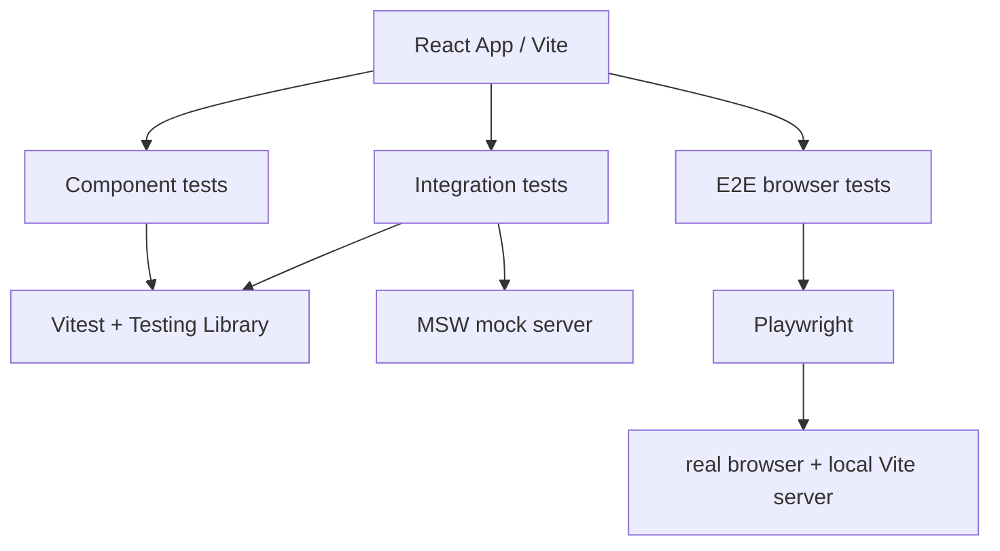

# Playwright Automation Framework

A layered testing framework for a React full-stack app, focused on reliable UI validation, flow coverage, and browser-level regression checks.

## Preview

Live app used as a test demo (React + Vite, Material UI):
https://currency-exchange-nadiia.netlify.app


## Testing

The project uses a layered testing approach to keep the app reliable and easy to maintain:

- Component and unit tests validate rendering, user interactions, and form logic.
- Integration tests cover the main conversion flow and error handling.
- End-to-end tests verify the app in a real browser.
  Coverage focuses on currency selection, amount input, conversion behavior, switching currencies, and failure states.

Tools used:

- Vitest + Testing Library for fast UI and component tests
- Playwright for browser-level regression testing
- MSW for mocking API responses

The CI/CD pipeline is configured in GitHub Actions and runs automated checks on push and pull request events.



## Application Stack

- React + Vite
- Material UI

## Test Stack

- Vitest
- Testing Library
- Playwright
- MSW
- k6

## Quick start

[Repository](https://github.com/NadiiaSka/playwright-automation-fraimework)

### Prerequisites

```bash
node --version
npm --version
```

Required:

- Node.js 22 or higher
- npm 8 or higher

### Install

```bash
git clone https://github.com/NadiiaSka/playwright-automation-fraimework.git
cd playwright-automation-fraimework
npm install
npx playwright install
```

### Run the full test suite

```bash
npm run test:run
npm run test:end-end
```

### Run the health performance test

Install [k6](https://grafana.com/docs/k6/latest/set-up/install-k6/) and start
the local application in a separate terminal:

```bash
npm run dev
```

Then run the health check load test. It runs five virtual users for 30 seconds
and fails when the HTTP error rate is at least 1% or the 95th percentile response
time is 200 ms or slower.

```bash
npm run test:performance:health
```

To target another environment, set `BASE_URL` before running k6. PowerShell:

```powershell
$env:BASE_URL = "https://example.com"
npm run test:performance:health
```

### Run against a specific browser

```bash
npm run test:chrome
npm run test:firefox
npm run test:webkit
npm run test:cross-browser
```

`test:cross-browser` runs the suite against Chromium, Firefox, and WebKit.

### Run focused suites

```bash
npm run test:component
npm run test:integration
npm run test:end-end
```

## Environments

The app uses Vite modes to configure the exchange-rate API URL. Safe example
templates are committed as `.env.ci.example` and `.env.production.example`.
CI copies `.env.ci.example` to its ignored `.env.ci` before building or starting
the local server. For local development, copy `.env.local.example` to
`.env.local`. Real `.env.*` files stay ignored. Never put API keys in `VITE_`
variables because Vite exposes them to browser bundles.

```bash
# Local development
npm run dev

# CI verification build
npm run build:ci

# Production build
npm run build:production
```

The GitHub Actions workflow builds and runs E2E tests using CI mode. A static
production build is produced in `dist`; deploy it with the hosting provider of
your choice. The Vite health endpoint is for development, CI, and preview only;
a production API needs its own backend health endpoint.
