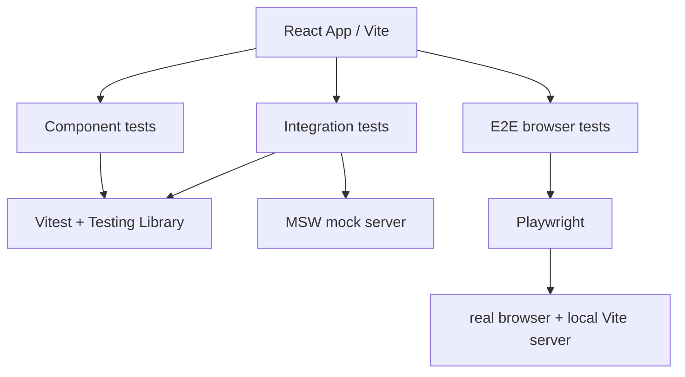

# Playwright Automation Framework

A layered testing framework for a React full-stack app, focused on reliable UI validation, flow coverage, and browser-level regression checks.

## Preview

Live app used as a test demo (React + Vite, Material UI):
https://currency-exchange-nadiia.netlify.app


## Testing

The quality gate runs on pull requests to `main`, pushes to `main` and
`develop`, and daily. Blocking checks are lint, production-mode compilation,
component/unit tests, integration tests, API contract tests, browser functional
tests, accessibility tests, application security tests, high-severity dependency
audit, Gitleaks, and CodeQL. Pull-request dependency review is additionally
blocking on PRs. The final `quality-gate` status summarizes required checks.

Informational checks are the k6 performance smoke test, k6 load test, visual
regression tests, and Firefox/WebKit functional runs. They upload their results
but do not block merging while the suite and baselines mature.

The blocking security checks include the `tests/security` Playwright suite,
`npm audit --audit-level=high`, Gitleaks secret scanning, CodeQL JavaScript/
TypeScript analysis, and high-severity dependency review on pull requests. The
audit report and security test reports are uploaded even when a check fails.

Tools used:

- Vitest + Testing Library for component and integration tests
- Playwright for API, functional, accessibility, visual, and cross-browser tests
- MSW for deterministic provider responses in component/integration tests
- k6 for HTTP performance smoke and load tests
- `npm audit` for dependency vulnerability auditing



## Application Stack

- React + Vite
- Material UI

## Test Stack

- Vitest
- Testing Library
- Playwright
- MSW
- k6
- axe-core

## Quick start

[Repository](https://github.com/NadiiaSka/playwright-automation-fraimework)

### Prerequisites

```bash
node --version
npm --version
```

Required:

- Node.js 22 or higher
- npm 8 or higher

### Install

```bash
git clone https://github.com/NadiiaSka/playwright-automation-fraimework.git
cd playwright-automation-fraimework
npm ci
npx playwright install
```

Create the ignored local environment file before starting the app or running
Playwright tests:

```bash
cp .env.local.example .env.local
cp .env.ci.example .env.ci
```

### Run test categories locally

```bash
npm run lint
npm run build:ci
npm run test:component
npm run test:integration
npm run test:api
npm run test:security
npm run test:functional
npm run test:accessibility
npm audit --audit-level=high
```

Playwright starts the local API and Vite server through its configured
`webServer` when they are not already running. Component and integration tests
use MSW and do not require a live provider.

### Security test scope

The tagged `@security` Playwright suite checks local HTML/API security headers,
API no-store behavior, same-origin-only access (CORS is not enabled), supported
methods, content types, malformed and oversized JSON, strict field/type/range
validation, non-reflective XSS/injection-like input rejection, and safe error
responses. The local API runs on the ignored CI/local environment configuration;
Playwright derives its URL from `VITE_APP_URL` or `BASE_URL`. No test credentials
or tokens are needed or stored.

This app currently has no authentication, authorization, login/logout, user
resources, session cookies, database, shell commands, or rate limiter. Tests for
credential validity, ownership/IDOR, revocation, cookie flags, SQL/NoSQL
injection, and rate-limit responses are therefore not applicable. The API binds
to loopback for local/CI use and intentionally emits no CORS allow headers.
Strict production headers are provided in `public/_headers` for Netlify; the
Vite development CSP allows the inline HMR bootstrap only in development. Do not
interpret this regression suite as a penetration test or a complete security
assessment.

### Visual regression tests

Run screenshot comparisons with the committed platform baselines:

```bash
npm run test:visual
```

Normal CI never updates snapshots. Linux baselines are generated on Ubuntu by
opening the `Quality Gate` workflow with `workflow_dispatch` and setting
`regenerate_visual_baselines` to `true`. Review and commit the downloaded
`regenerated-linux-visual-baselines` artifact; do not copy Windows snapshots
over Linux baselines. To regenerate locally, use Linux and run:

```bash
npm run test:visual:update
```

Visual tests use deterministic API responses, `en-US`, UTC, disabled screenshot
animations, and a 2% maximum pixel-difference ratio.

### Performance and load tests

Install [k6](https://grafana.com/docs/k6/latest/set-up/install-k6/), start the
local app with `npm run dev`, then set the app URL and run either profile:

```bash
BASE_URL=http://127.0.0.1:5173 npm run test:performance:smoke
BASE_URL=http://127.0.0.1:5173 npm run test:performance:health
```

The smoke profile sends five requests from one virtual user. The load profile
runs five virtual users for 30 seconds and checks failure rate and p95 latency.

### Cross-browser tests

```bash
npx playwright install firefox webkit
npm run test:cross-browser
```

The informational CI cross-browser job currently runs the currency functional
flow on Firefox and WebKit; Chromium functional and accessibility checks are
blocking.

### Run the health performance test

Install [k6](https://grafana.com/docs/k6/latest/set-up/install-k6/) and start
the local application in a separate terminal:

```bash
npm run dev
```

Then run the health check load test. It runs five virtual users for 30 seconds
and fails when the HTTP error rate is at least 1% or the 95th percentile response
time is 200 ms or slower.

```bash
npm run test:performance:health
```

To target another environment, set `BASE_URL` before running k6. PowerShell:

```powershell
$env:BASE_URL = "https://example.com"
npm run test:performance:health
```

### Run against a specific browser

```bash
npm run test:chrome
npm run test:firefox
npm run test:webkit
npm run test:cross-browser
```

`test:cross-browser` runs the suite against Chromium, Firefox, and WebKit.

### Run focused suites

```bash
npm run test:component
npm run test:integration
npm run test:end-end
```

## Environments

The app uses Vite modes to configure the exchange-rate API URL. Safe example
templates are committed as `.env.ci.example` and `.env.production.example`.
CI copies `.env.ci.example` to its ignored `.env.ci` before building or starting
the local server. For local development, copy `.env.local.example` to
`.env.local`. Real `.env.*` files stay ignored. Never put API keys in `VITE_`
variables because Vite exposes them to browser bundles.

```bash
# Local development
npm run dev

# CI verification build
npm run build:ci

# Production build
npm run build:production
```

The GitHub Actions quality gate builds and tests using CI mode. A static
production build is produced in `dist`; deploy it with the hosting provider of
your choice. The local API service is for development and CI; production should
point at the deployed API provider through environment configuration.
